# StUpIdSpEeD (programming language speed benchmark)

Measures the speed of programming languages in the simplest ways possible.

15 tiny tasks, written in every language below, timed and compared.
The code is AI generated by an LLM from the specs in this file.

## Two axes: 191 front ends, 75 backends

The matrix has two axes and the results are reported on both.

- A **front end** is a language and the toolchain that compiles, JITs or interprets
  it: `Ada`/`gnat`, `C`/`gcc`, `C++`/`g++`, `Rust`/`rustc`, `Swift`/`swiftc`. There
  are **191** of them here, over **84** languages.
- A **backend** is what actually executes the result: the code generator or virtual
  machine the front end hands its program to. There are only **75**, and seven of
  them carry 81 of the 191 front ends — **GCC** 16, **LLVM** 19, **wasmtime**
  Cranelift 11 and **wasmtime** Winch 8 (one runtime, two code generators), **V8**
  11, and **Wasmer**'s Cranelift, LLVM and Singlepass compilers at 8 each. Fifteen
  more carry 2-5 each — the JVM's **HotSpot** configurations, .NET's **CoreCLR** (5)
  and the **BEAM** (4) among them, 57 front ends between them — and the remaining 53
  carry exactly one front end apiece.

```mermaid
flowchart LR
  subgraph F["front ends — 191"]
    direction TB
    a["ada · fortran · modula-2 · cobol · vala · nim · v · cython · eiffel · seed7"]
    b["c · c++"]
    c["rust · swift · zig · crystal · odin · pony · lean 4 · terra · beef"]
    d["java · kotlin · scala · clojure · groovy"]
    e["c# · f# · vb.net · boo · component pascal"]
    f["erlang · elixir · gleam"]
    g["c · c++ · rust · go · zig · tinygo · assemblyscript · webassembly"]
  end
  subgraph B["backends — 75"]
    direction TB
    gcc["GCC — 16 front ends"]
    llvm["LLVM — 19"]
    jvm["HotSpot — 7"]
    clr[".NET CoreCLR — 5"]
    beam["BEAM — 4"]
    wasm["wasmtime · Winch · WasmEdge · WAMR · V8 · Wasmer"]
  end
  a --> gcc
  b --> gcc
  b --> llvm
  c --> llvm
  d --> jvm
  e --> clr
  f --> beam
  g --> wasm
```



`ada`, `fortran`, `modula-2`, `cobol`, `vala`, `nim`, `mercury`, `ats`, `eiffel`,
`seed7`, `v`, `nelua`, `cython` and `haxe`'s hxcpp row are all GCC; `java`,
`kotlin`, `scala`, `clojure` and `groovy` are all HotSpot; `c#`, `f#`, `vb.net`,
`boo` and `gpcp` are all CoreCLR. Comparing two front ends on one backend measures
what the language costs before the backend sees it — `ada` against `c` on GCC.
Comparing two backends measures the backend — `c` on gcc against clang and msvc, or
one WebAssembly module on eight backends — wasmtime's two compilers, Wasmer's three,
WasmEdge, WAMR and node's V8 — with the front end held perfectly fixed.

Every table below carries both. `exec/cells.json` is the registry that assigns a
backend to every toolchain, `exec/harness.py --backends` prints the two axes side by
side, and `--backend gcc` runs one backend's front ends. See [Results](#results).

What you need installed to build the programs is in `BUILD.md`, and what you need to
run them is in `RUN.md`.

## What is in the repository

| Path | What it is |
|---|---|
| `sources/<row>/` | the fifteen task programs for every row, as written |
| `exec/<row>/` | the same rows built: each task's compiled program or staged script, plus that row's `build_all.bat`/`run_all.bat` and `verify.py` |
| `exec/harness.py` | the test harness: runs every built program in `exec/`, N times each, and records speed, peak memory and program size |
| `exec/cells.json` | the harness's registry: how to run each of the 2774 cells, transcribed from the row verifiers, plus the backend table that says what actually executes each one |
| `exec/plot.py` | turns `results.json` into `results.html`, the interactive chart of the whole matrix: one line per toolchain, or one per backend, coloured by backend kind |
| `data.bin` | the 50 MiB fixture tasks 14 and 15 use, committed once at the root |
| `BUILD.md`, `RUN.md` | how each row is built, and how it is run |

The built programs are committed, so a checkout can be verified without installing anything
first — that is what `exec/<row>/verify.py` does, one row at a time. They are 4.13 GB across
22 198 unique files; the paths number 34 037, because a build stages its own copies of the
task sources and of the fixture, and git stores one blob per distinct content.

One row's output is a *directory* package rather than a single file — the ActionScript row's
`out\` — and the AIR runtime validates the bytes inside it, so `.gitattributes` marks those
directories `-text` and they are checked out exactly as committed. A checkout that
line-ending-converts them fails every ActionScript cell with `invalid license or package`;
`RUN.md` has the measurements and the one-line repair for an older clone.

`exec/harness.py` runs all of them and measures them. It reads the cell registry at
`exec/cells.json` — how to invoke each of the 2774 cells, transcribed from the row verifiers,
which stay the authority on how a row is built and run — runs each cell `--runs` times, and
writes `exec/results.json` (every sample) and `exec/results.md` (the speed, peak-memory and
program-size tables below, in the same shape as the results table, each grouped by backend).

```
python exec/harness.py --runs 5              # the whole matrix, five timed runs a cell
python exec/harness.py --runs 1              # one pass, for a quick look
python exec/harness.py --rows c,rust --tasks 01,07
python exec/harness.py --rows actionscript   # one row, by its folder under exec/
python exec/harness.py --language C++        # every row of one language
python exec/harness.py --backends            # the two axes: backends and their front ends
python exec/harness.py --backend gcc         # one backend's 16 front ends
python exec/harness.py --start 1 --end 200   # items 1-200, by position in --list
python exec/harness.py --rows 1-30           # the first thirty languages
python exec/harness.py --check               # one run each: pass/fail, no timing
python exec/harness.py --list --rows zig     # what would run, without running it
```

Every cell has a number — its position in `--list` order, row then toolchain then task — and
`--start`/`--end` take a slice of the matrix by that number, which is how a full sweep is run
in chunks. `--rows` also takes numbers and ranges, so `--rows 1-30` is the first thirty
languages and `--rows 1-106` is all of them.

A single language is run by naming its folder: `--rows actionscript` is that row's fifteen
cells, in any case and as a path (`--rows exec/ada`, `--rows sources\ada`). A language the
results table splits across rows is run with `--language` and the name that table gives it —
`--language C++` is the `cpp` and `cpp-wasm` rows, `--language Python` is `python`,
`python-cython` and `python-wasm`. The two are unioned, and a name that matches no
row is an error rather than an empty run: since results are merged, a run that selected
nothing would otherwise look like a run that measured nothing.

`--backend` picks the other axis: it keeps only the front ends that execute on the named
backend, by id or by the display name the tables print (`--backend gcc`, `--backend llvm`,
`--backend "HotSpot C2"`, `--backend beam`). It narrows whatever `--rows`/`--language` named,
the way `--tasks` does, and names toolchains rather than whole rows — the `c` row is four
front ends on four backends, so `--rows c --backend llvm` is that row's clang cells and leaves
its gcc, tcc and msvc cells alone. `--backends` prints the axis without running anything: one
line per backend with its kind and the front ends and languages it carries, biggest first.

**Results are additive.** Each run merges into `exec/results.json` instead of replacing it: a
cell measured again replaces its own older row, a cell not run this time keeps the number it
already had, and `--replace` is there for starting over. So the chunks above build one
complete matrix between them, and a sweep that is interrupted — or killed — is continued with
`--start` rather than repeated. The file is also written atomically and flushed every
`--flush-every` cells (25 by default), so a run cut off mid-way keeps everything it measured
except the last few, instead of losing the lot.

`exec/plot.py` turns that file into `exec/results.html`: one self-contained page, no server
and no network, with a zoomable chart of every toolchain across the fifteen tasks, a ranked
bar chart per task, and the metric switchable between `TIME_MS`, wall clock, memory and
program size.

```
python exec/plot.py --open                   # results.json -> results.html, and open it
```

For each cell the harness records the program's own `TIME_MS` line — the contract's number,
which excludes start-up — beside the harness's end-to-end wall clock, the child's peak working
set, and the size of the built program. A cell with no `TIME_MS` line is reported with its wall
clock instead, marked `*`; a cell that cannot run on this machine — toolchain absent, or a
runtime it needs not installed — is reported as skipped rather than failed, and one that ran
but crashed after printing its answer is measured with a `!` note. Cells run one at a time,
each pinned to a single core — four for task 11 — and nothing the harness runs writes to a
terminal or can leave a crash dialog waiting for a click.

`tools/` is **not** committed: it is ~28 GB of third-party compilers and runtimes, and
`BUILD.md` lists what to install instead. `temp/` is scratch and is not committed either.

## Results

**191 front ends, 75 backends, 2774 cells.** Every table below is ordered by backend, so all
the front ends that land on one backend sit together, and the `Backend` column repeats on
every line — `grep '^| GCC '` is every row GCC runs, whatever front end is above it.

| Backend | Kind | Front ends | Cells | What it is |
|---|---|---|---|---|
| LLVM | `native-aot` | 19 | 285 | LLVM IR and an LLVM backend (clang, rustc, swiftc, zig, ldc2, ...) |
| GCC | `native-aot` | 16 | 240 | the GNU Compiler Collection: parses, optimises and emits machine code |
| V8 | `native-jit` | 11 | 160 | tiered JIT (Ignition + TurboFan); here it runs the wasm module through the WASI shim |
| wasmtime (Cranelift) | `wasm-runtime` | 11 | 165 | Cranelift JITs the wasm module on every run — wasmtime's optimising compiler |
| Wasmer (Cranelift) | `wasm-runtime` | 8 | 99 | Wasmer's WASIX runtime with its Cranelift compiler |
| Wasmer (LLVM) | `wasm-runtime` | 8 | 99 | the same runtime, LLVM compiler |
| Wasmer (Singlepass) | `wasm-runtime` | 8 | 96 | the same runtime, Singlepass: a fast single-pass compiler with no optimisation |
| wasmtime (Winch) | `wasm-runtime` | 8 | 120 | Winch, wasmtime's baseline single-pass compiler, on the same modules as Cranelift |
| WAMR (iwasm) | `wasm-runtime` | 7 | 105 | WebAssembly Micro Runtime; the release build JITs via LLVM or interprets |
| WasmEdge | `wasm-runtime` | 7 | 100 | WasmEdge JITs the module on every run |
| CoreCLR | `native-jit` | 5 | 75 | the .NET runtime's JIT |
| HotSpot (tiered C1 + C2) | `native-jit` | 5 | 75 | the JVM's default tiered compilation: C1 first, C2 for the hot methods |
| BEAM | `native-jit` | 4 | 60 | the Erlang VM's per-process scheduler and JIT |
| MSVC | `native-aot` | 4 | 60 | Microsoft's cl.exe: parses, optimises and emits machine code |
| none — hand-written machine code | `assembler` | 3 | 45 | an assembler, not a compiler: the source already is machine code |
| Chez Scheme | `native-aot` | 2 | 30 | Chez's own code generator |
| GNU R | `bytecode-vm` | 2 | 30 | R's byte-code compiler and evaluator |
| GraalVM JIT | `native-jit` | 2 | 30 | the Graal compiler replacing HotSpot's C2 |
| GraalVM native-image | `native-aot` | 2 | 30 | ahead-of-time native image built from the same class files |
| JavaScriptCore | `native-jit` | 2 | 30 | tiered JIT (LLInt + DFG + FTL) |
| LLVM (JIT) | `native-jit` | 2 | 30 | per-method LLVM compilation on first call |
| OpenJ9 | `native-jit` | 2 | 30 | Eclipse OpenJ9's JIT, a different VM from HotSpot |
| ADW | `native-aot` | 1 | 15 | ADW Modula-2, direct to object |
| Akron | `native-aot` | 1 | 15 | Akron Oberon-07, direct to object |
| Algol 68 Genie | `interpreter` | 1 | 15 | a compiler-interpreter: parses and executes, no build step |
| AutoHotkey | `interpreter` | 1 | 15 | AutoHotkey's expression compiler and interpreter |
| AVM2 (AIR) | `native-jit` | 1 | 15 | the ActionScript VM's JIT |
| CoreCLR NativeAOT | `native-aot` | 1 | 15 | ahead-of-time native .NET |
| CPython | `bytecode-vm` | 1 | 15 | the reference Python bytecode VM |
| Cranelift (rustc) | `native-aot` | 1 | 15 | rustc's MIR lowered by Cranelift instead of LLVM (-Zcodegen-backend=cranelift) |
| CRuby | `bytecode-vm` | 1 | 15 | the reference Ruby ISeq VM |
| Dart AOT | `native-aot` | 1 | 15 | dart compile exe |
| Dart VM | `native-jit` | 1 | 15 | the Dart VM's JIT |
| DMD | `native-aot` | 1 | 15 | Digital Mars D, its own backend |
| Dolphin VM | `native-jit` | 1 | 15 | a prebuilt image on Dolphin's VM |
| Euphoria | `interpreter` | 1 | 15 | a tree-walking interpreter |
| Factor | `native-jit` | 1 | 15 | Factor compiles the script and runs it on every invocation |
| FPC | `native-aot` | 1 | 15 | Free Pascal Compiler, its own backend |
| FreeBASIC | `native-aot` | 1 | 15 | fbc's own emitter |
| gforth | `interpreter` | 1 | 15 | threaded-code interpreter |
| GHC | `native-aot` | 1 | 15 | GHC's own STG/Cmm code generator |
| Go (gc) | `native-aot` | 1 | 15 | Go's own SSA backend and linker |
| Godot | `bytecode-vm` | 1 | 15 | Godot parses and runs the script |
| HashLink | `bytecode-vm` | 1 | 15 | Haxe's own VM |
| HotSpot (interpreter) | `bytecode-vm` | 1 | 15 | -Xint: the template interpreter, no JIT at all |
| HotSpot C1 | `native-jit` | 1 | 15 | -XX:TieredStopAtLevel=1: the client compiler only, the C2 tier never runs |
| HotSpot C2 | `native-jit` | 1 | 15 | -XX:-TieredCompilation: the server compiler only, no C1 profiling tier |
| Intel oneAPI (DPC++) | `native-aot` | 1 | 15 | Intel's downstream LLVM fork (clang 24 from intel/llvm), a different build and optimisation pipeline from upstream clang |
| Janet | `bytecode-vm` | 1 | 15 | Janet compiles to bytecode on every run |
| JScript | `interpreter` | 1 | 15 | the Windows Script Host JScript engine |
| Lobster | `bytecode-vm` | 1 | 15 | Lobster compiles to bytecode, then runs it |
| LuaJIT | `native-jit` | 1 | 15 | trace compilation |
| Luau | `bytecode-vm` | 1 | 12 | Luau's VM |
| Lute | `native-jit` | 1 | 3 | the Luau team's own runtime, for the tasks luau.exe cannot run |
| MoarVM | `bytecode-vm` | 1 | 15 | Rakudo's VM |
| Mono | `native-jit` | 1 | 15 | Mono's JIT, a different runtime from CoreCLR |
| Mono AOT | `native-aot` | 1 | 15 | mono --aot=full's native module for the same assembly, run by --full-aot with the JIT switched off |
| OCaml (ocamlc) | `bytecode-vm` | 1 | 15 | OCaml's bytecode interpreter |
| OCaml (ocamlopt) | `native-aot` | 1 | 15 | OCaml's own native code generator |
| Perl | `interpreter` | 1 | 15 | the perl interpreter |
| Pharo VM | `native-jit` | 1 | 15 | a prebuilt image on Pharo's Cog VM |
| Poly/ML | `native-aot` | 1 | 15 | Poly/ML's own x86-64 code generator |
| PUC Lua | `bytecode-vm` | 1 | 15 | Lua's register VM |
| PyPy | `native-jit` | 1 | 15 | trace compilation |
| QuickJS | `bytecode-vm` | 1 | 15 | QuickJS compiles to bytecode, then its own VM |
| Ring | `bytecode-vm` | 1 | 15 | Ring's VM |
| SBCL | `native-aot` | 1 | 15 | SBCL compiles to machine code at run time and on demand |
| SpiderMonkey | `native-jit` | 1 | 15 | tiered JIT (Baseline + Ion) |
| SWI-Prolog | `bytecode-vm` | 1 | 15 | SWI's in-memory clause representation |
| TCC | `native-aot` | 1 | 15 | Tiny C Compiler: one pass, no optimisation |
| Tcl | `bytecode-vm` | 1 | 15 | Tcl's bytecode compiler and VM |
| Unicon | `bytecode-vm` | 1 | 15 | icont compiles to icode, appended to the executable |
| VBScript | `interpreter` | 1 | 15 | the Windows Script Host VBScript engine |
| Zend | `bytecode-vm` | 1 | 15 | PHP's opcode VM |
| Zend JIT | `native-jit` | 1 | 15 | opcode JIT on top of the Zend VM |

Twenty-two of the 75 backends carry more than one front end, and between them they carry 138 of
the 191; the other 53 carry exactly one front end each. That is the whole point of the axis:
**`ada`, `fortran`, `modula-2`, `c`, `c++`, `cobol`, `vala`, `nim`, `mercury`, `ats`,
`eiffel`, `seed7`, `v`, `nelua`, `cython` and `haxe`'s hxcpp row are all GCC.** Their
differences are front-end differences — what the language's own semantics cost before the C
compiler sees anything — and none of them is a comparison of code generators. The same is true
of the nineteen LLVM front ends, the five CLR rows, and the four BEAM rows — where `erlang` and
`elixir` are the same VM under two languages, and `erlang`'s two toolchains differ only in
*when* the compile happens, `escript` compiling the script on every run and `erlc` compiling it
once.

### What a backend's kind means

A backend's `kind` says what its measured number contains, and two rows are only comparable
within a kind:

| Kind | What the measured number contains |
|---|---|
| `native-aot` | nothing but the program: the compile finished before the clock started |
| `native-jit` | the VM's compilation of the code it is running, plus the program |
| `wasm-runtime` | the runtime's translation of the module, plus the program |
| `bytecode-vm` | the VM's dispatch on every operation |
| `interpreter` | the interpreter's walk over the source or its tree |
| `assembler` | nothing but the program; there is no compiler in the row at all |

### The matrix

One line per **front end** — a language and the toolchain that builds or runs it — grouped by
backend. The column headings are the task numbers, and the task names are the section headings
under [Tasks](#tasks). All 191 front ends, empty and ready to fill in.

A cell holds the median of the 5 timed runs, in milliseconds. `exec/harness.py` writes the
same table with the numbers in it to `exec/results.md`, preceded by a per-backend rollup, and
`exec/plot.py` draws the matrix twice: **per toolchain** (one line per front end, grouped in
the legend under its backend) and **per backend** (one line per backend, each point the median
of that backend's rows' medians). Both are coloured by backend kind, so the six kinds are
distinguishable at a glance and a line's colour says what sort of thing it is.

| Backend | Language | Toolchain | 01 | 02 | 03 | 04 | 05 | 06 | 07 | 08 | 09 | 10 | 11 | 12 | 13 | 14 | 15 |
|---|---|---|---|---|---|---|---|---|---|---|---|---|---|---|---|---|---|
| ADW | Modula-2 | adw |  |  |  |  |  |  |  |  |  |  |  |  |  |  |  |
| Akron | Oberon-07 | akron |  |  |  |  |  |  |  |  |  |  |  |  |  |  |  |
| Algol 68 Genie | Algol 68 | a68g |  |  |  |  |  |  |  |  |  |  |  |  |  |  |  |
| AutoHotkey | AutoHotkey | v2 |  |  |  |  |  |  |  |  |  |  |  |  |  |  |  |
| AVM2 (AIR) | ActionScript | AIR |  |  |  |  |  |  |  |  |  |  |  |  |  |  |  |
| BEAM | Elixir | elixir (BEAM) |  |  |  |  |  |  |  |  |  |  |  |  |  |  |  |
| BEAM | Erlang | erlc (compiled) |  |  |  |  |  |  |  |  |  |  |  |  |  |  |  |
| BEAM | Erlang | OTP (escript) |  |  |  |  |  |  |  |  |  |  |  |  |  |  |  |
| BEAM | Gleam | gleam |  |  |  |  |  |  |  |  |  |  |  |  |  |  |  |
| Chez Scheme | Racket | racket (CS) |  |  |  |  |  |  |  |  |  |  |  |  |  |  |  |
| Chez Scheme | Scheme | chez |  |  |  |  |  |  |  |  |  |  |  |  |  |  |  |
| CoreCLR | Boo | booc |  |  |  |  |  |  |  |  |  |  |  |  |  |  |  |
| CoreCLR | C# | coreclr |  |  |  |  |  |  |  |  |  |  |  |  |  |  |  |
| CoreCLR | Component Pascal | gpcp |  |  |  |  |  |  |  |  |  |  |  |  |  |  |  |
| CoreCLR | F# | dotnet |  |  |  |  |  |  |  |  |  |  |  |  |  |  |  |
| CoreCLR | VB.NET | dotnet |  |  |  |  |  |  |  |  |  |  |  |  |  |  |  |
| CoreCLR NativeAOT | C# | nativeaot |  |  |  |  |  |  |  |  |  |  |  |  |  |  |  |
| CPython | Python | cpython |  |  |  |  |  |  |  |  |  |  |  |  |  |  |  |
| Cranelift (rustc) | Rust | rustc (cranelift) |  |  |  |  |  |  |  |  |  |  |  |  |  |  |  |
| CRuby | Ruby | cruby-yjit |  |  |  |  |  |  |  |  |  |  |  |  |  |  |  |
| Dart AOT | Dart | aot |  |  |  |  |  |  |  |  |  |  |  |  |  |  |  |
| Dart VM | Dart | jit |  |  |  |  |  |  |  |  |  |  |  |  |  |  |  |
| DMD | D | dmd |  |  |  |  |  |  |  |  |  |  |  |  |  |  |  |
| Dolphin VM | Dolphin Smalltalk | Dolphin 8 |  |  |  |  |  |  |  |  |  |  |  |  |  |  |  |
| Euphoria | Euphoria | eui |  |  |  |  |  |  |  |  |  |  |  |  |  |  |  |
| Factor | Factor | factor |  |  |  |  |  |  |  |  |  |  |  |  |  |  |  |
| FPC | Pascal | fpc |  |  |  |  |  |  |  |  |  |  |  |  |  |  |  |
| FreeBASIC | BASIC | freebasic |  |  |  |  |  |  |  |  |  |  |  |  |  |  |  |
| GCC | Ada | gnat |  |  |  |  |  |  |  |  |  |  |  |  |  |  |  |
| GCC | ATS | ats (gcc) |  |  |  |  |  |  |  |  |  |  |  |  |  |  |  |
| GCC | C | gcc |  |  |  |  |  |  |  |  |  |  |  |  |  |  |  |
| GCC | C++ | g++ |  |  |  |  |  |  |  |  |  |  |  |  |  |  |  |
| GCC | COBOL | gnucobol |  |  |  |  |  |  |  |  |  |  |  |  |  |  |  |
| GCC | Eiffel | eiffelstudio |  |  |  |  |  |  |  |  |  |  |  |  |  |  |  |
| GCC | Fortran | gfortran |  |  |  |  |  |  |  |  |  |  |  |  |  |  |  |
| GCC | Haxe | hxcpp |  |  |  |  |  |  |  |  |  |  |  |  |  |  |  |
| GCC | Mercury | mmc |  |  |  |  |  |  |  |  |  |  |  |  |  |  |  |
| GCC | Nelua | nelua |  |  |  |  |  |  |  |  |  |  |  |  |  |  |  |
| GCC | Nim | nim |  |  |  |  |  |  |  |  |  |  |  |  |  |  |  |
| GCC | Python | cython |  |  |  |  |  |  |  |  |  |  |  |  |  |  |  |
| GCC | Python | nuitka |  |  |  |  |  |  |  |  |  |  |  |  |  |  |  |
| GCC | Seed7 | s7c |  |  |  |  |  |  |  |  |  |  |  |  |  |  |  |
| GCC | V | v |  |  |  |  |  |  |  |  |  |  |  |  |  |  |  |
| GCC | Vala | valac |  |  |  |  |  |  |  |  |  |  |  |  |  |  |  |
| gforth | Forth | gforth |  |  |  |  |  |  |  |  |  |  |  |  |  |  |  |
| GHC | Haskell | ghc |  |  |  |  |  |  |  |  |  |  |  |  |  |  |  |
| GNU R | R | gnu-r |  |  |  |  |  |  |  |  |  |  |  |  |  |  |  |
| GNU R | R | gnu-r (no JIT) |  |  |  |  |  |  |  |  |  |  |  |  |  |  |  |
| Go (gc) | Go | gc |  |  |  |  |  |  |  |  |  |  |  |  |  |  |  |
| Godot | GDScript | godot --headless |  |  |  |  |  |  |  |  |  |  |  |  |  |  |  |
| GraalVM JIT | Java | graalvm jit |  |  |  |  |  |  |  |  |  |  |  |  |  |  |  |
| GraalVM JIT | Python | graalpy |  |  |  |  |  |  |  |  |  |  |  |  |  |  |  |
| GraalVM native-image | Clojure | babashka |  |  |  |  |  |  |  |  |  |  |  |  |  |  |  |
| GraalVM native-image | Java | graalvm native-image |  |  |  |  |  |  |  |  |  |  |  |  |  |  |  |
| HashLink | Haxe | hashlink |  |  |  |  |  |  |  |  |  |  |  |  |  |  |  |
| HotSpot (interpreter) | Java | openjdk (interp) |  |  |  |  |  |  |  |  |  |  |  |  |  |  |  |
| HotSpot (tiered C1 + C2) | Clojure | clojure.main |  |  |  |  |  |  |  |  |  |  |  |  |  |  |  |
| HotSpot (tiered C1 + C2) | Groovy | groovy |  |  |  |  |  |  |  |  |  |  |  |  |  |  |  |
| HotSpot (tiered C1 + C2) | Java | openjdk |  |  |  |  |  |  |  |  |  |  |  |  |  |  |  |
| HotSpot (tiered C1 + C2) | Kotlin | jvm |  |  |  |  |  |  |  |  |  |  |  |  |  |  |  |
| HotSpot (tiered C1 + C2) | Scala | jvm |  |  |  |  |  |  |  |  |  |  |  |  |  |  |  |
| HotSpot C1 | Java | openjdk (c1) |  |  |  |  |  |  |  |  |  |  |  |  |  |  |  |
| HotSpot C2 | Java | openjdk (c2) |  |  |  |  |  |  |  |  |  |  |  |  |  |  |  |
| Intel oneAPI (DPC++) | C | icx (oneAPI) |  |  |  |  |  |  |  |  |  |  |  |  |  |  |  |
| Janet | Janet | janet |  |  |  |  |  |  |  |  |  |  |  |  |  |  |  |
| JavaScriptCore | JavaScript | bun |  |  |  |  |  |  |  |  |  |  |  |  |  |  |  |
| JavaScriptCore | TypeScript | bun |  |  |  |  |  |  |  |  |  |  |  |  |  |  |  |
| JScript | JScript | cscript (WSH) |  |  |  |  |  |  |  |  |  |  |  |  |  |  |  |
| LLVM | BASIC | qb64 |  |  |  |  |  |  |  |  |  |  |  |  |  |  |  |
| LLVM | Beef | BeefBuild |  |  |  |  |  |  |  |  |  |  |  |  |  |  |  |
| LLVM | C | clang |  |  |  |  |  |  |  |  |  |  |  |  |  |  |  |
| LLVM | C++ | clang++ |  |  |  |  |  |  |  |  |  |  |  |  |  |  |  |
| LLVM | C3 | c3c |  |  |  |  |  |  |  |  |  |  |  |  |  |  |  |
| LLVM | Crystal | crystal |  |  |  |  |  |  |  |  |  |  |  |  |  |  |  |
| LLVM | D | ldc2 |  |  |  |  |  |  |  |  |  |  |  |  |  |  |  |
| LLVM | Fortran | flang |  |  |  |  |  |  |  |  |  |  |  |  |  |  |  |
| LLVM | Go | tinygo |  |  |  |  |  |  |  |  |  |  |  |  |  |  |  |
| LLVM | Kotlin | native |  |  |  |  |  |  |  |  |  |  |  |  |  |  |  |
| LLVM | Lean 4 | lean |  |  |  |  |  |  |  |  |  |  |  |  |  |  |  |
| LLVM | Objective-C | clang (objc) |  |  |  |  |  |  |  |  |  |  |  |  |  |  |  |
| LLVM | Odin | odin |  |  |  |  |  |  |  |  |  |  |  |  |  |  |  |
| LLVM | Pony | ponyc |  |  |  |  |  |  |  |  |  |  |  |  |  |  |  |
| LLVM | Rust | rustc |  |  |  |  |  |  |  |  |  |  |  |  |  |  |  |
| LLVM | Scala | native |  |  |  |  |  |  |  |  |  |  |  |  |  |  |  |
| LLVM | Swift | swiftc |  |  |  |  |  |  |  |  |  |  |  |  |  |  |  |
| LLVM | Terra | terra |  |  |  |  |  |  |  |  |  |  |  |  |  |  |  |
| LLVM | Zig | zig |  |  |  |  |  |  |  |  |  |  |  |  |  |  |  |
| LLVM (JIT) | Julia | julia |  |  |  |  |  |  |  |  |  |  |  |  |  |  |  |
| LLVM (JIT) | Julia | julia (interpreted) |  |  |  |  |  |  |  |  |  |  |  |  |  |  |  |
| Lobster | Lobster | lobster |  |  |  |  |  |  |  |  |  |  |  |  |  |  |  |
| LuaJIT | Lua | luajit |  |  |  |  |  |  |  |  |  |  |  |  |  |  |  |
| Luau | Luau | luau |  |  |  |  |  |  |  |  |  |  |  |  |  |  |  |
| Lute | Luau | lute |  |  |  |  |  |  |  |  |  |  |  |  |  |  |  |
| MoarVM | Raku | rakudo (MoarVM) |  |  |  |  |  |  |  |  |  |  |  |  |  |  |  |
| Mono | C# | mono |  |  |  |  |  |  |  |  |  |  |  |  |  |  |  |
| Mono AOT | C# | mono (aot) |  |  |  |  |  |  |  |  |  |  |  |  |  |  |  |
| MSVC | C | msvc |  |  |  |  |  |  |  |  |  |  |  |  |  |  |  |
| MSVC | C++ | msvc |  |  |  |  |  |  |  |  |  |  |  |  |  |  |  |
| MSVC | Common Lisp | ecl |  |  |  |  |  |  |  |  |  |  |  |  |  |  |  |
| MSVC | Modula-3 | cm3 |  |  |  |  |  |  |  |  |  |  |  |  |  |  |  |
| none — hand-written machine code | Assembly | x86-64 fasm |  |  |  |  |  |  |  |  |  |  |  |  |  |  |  |
| none — hand-written machine code | Assembly | x86-64 masm |  |  |  |  |  |  |  |  |  |  |  |  |  |  |  |
| none — hand-written machine code | Assembly | x86-64 nasm |  |  |  |  |  |  |  |  |  |  |  |  |  |  |  |
| OCaml (ocamlc) | OCaml | ocamlc (bytecode) |  |  |  |  |  |  |  |  |  |  |  |  |  |  |  |
| OCaml (ocamlopt) | OCaml | ocamlopt |  |  |  |  |  |  |  |  |  |  |  |  |  |  |  |
| OpenJ9 | Java | openj9 |  |  |  |  |  |  |  |  |  |  |  |  |  |  |  |
| OpenJ9 | Ruby | jruby |  |  |  |  |  |  |  |  |  |  |  |  |  |  |  |
| Perl | Perl | perl |  |  |  |  |  |  |  |  |  |  |  |  |  |  |  |
| Pharo VM | Pharo | Pharo 13 |  |  |  |  |  |  |  |  |  |  |  |  |  |  |  |
| Poly/ML | Standard ML | Poly/ML |  |  |  |  |  |  |  |  |  |  |  |  |  |  |  |
| PUC Lua | Lua | puc-lua |  |  |  |  |  |  |  |  |  |  |  |  |  |  |  |
| PyPy | Python | pypy |  |  |  |  |  |  |  |  |  |  |  |  |  |  |  |
| QuickJS | JavaScript | quickjs |  |  |  |  |  |  |  |  |  |  |  |  |  |  |  |
| Ring | Ring | ring |  |  |  |  |  |  |  |  |  |  |  |  |  |  |  |
| SBCL | Common Lisp | sbcl |  |  |  |  |  |  |  |  |  |  |  |  |  |  |  |
| SpiderMonkey | JavaScript | spidermonkey |  |  |  |  |  |  |  |  |  |  |  |  |  |  |  |
| SWI-Prolog | Prolog (SWI) | swipl |  |  |  |  |  |  |  |  |  |  |  |  |  |  |  |
| TCC | C | tcc |  |  |  |  |  |  |  |  |  |  |  |  |  |  |  |
| Tcl | Tcl | tclsh |  |  |  |  |  |  |  |  |  |  |  |  |  |  |  |
| Unicon | Unicon | unicon |  |  |  |  |  |  |  |  |  |  |  |  |  |  |  |
| V8 | AssemblyScript | node (wasip1) |  |  |  |  |  |  |  |  |  |  |  |  |  |  |  |
| V8 | C | node (wasip1) |  |  |  |  |  |  |  |  |  |  |  |  |  |  |  |
| V8 | C++ | node (wasip1) |  |  |  |  |  |  |  |  |  |  |  |  |  |  |  |
| V8 | Clojure | cljs.main |  |  |  |  |  |  |  |  |  |  |  |  |  |  |  |
| V8 | Go | node (wasip1) |  |  |  |  |  |  |  |  |  |  |  |  |  |  |  |
| V8 | JavaScript | deno |  |  |  |  |  |  |  |  |  |  |  |  |  |  |  |
| V8 | Rust | node (wasip1) |  |  |  |  |  |  |  |  |  |  |  |  |  |  |  |
| V8 | Scala | scala-cli (js) |  |  |  |  |  |  |  |  |  |  |  |  |  |  |  |
| V8 | TinyGo | node (wasip1) |  |  |  |  |  |  |  |  |  |  |  |  |  |  |  |
| V8 | TypeScript | deno |  |  |  |  |  |  |  |  |  |  |  |  |  |  |  |
| V8 | Zig | node (wasip1) |  |  |  |  |  |  |  |  |  |  |  |  |  |  |  |
| VBScript | VBScript | cscript |  |  |  |  |  |  |  |  |  |  |  |  |  |  |  |
| WAMR (iwasm) | AssemblyScript | iwasm |  |  |  |  |  |  |  |  |  |  |  |  |  |  |  |
| WAMR (iwasm) | C | iwasm |  |  |  |  |  |  |  |  |  |  |  |  |  |  |  |
| WAMR (iwasm) | C++ | iwasm |  |  |  |  |  |  |  |  |  |  |  |  |  |  |  |
| WAMR (iwasm) | Go | iwasm |  |  |  |  |  |  |  |  |  |  |  |  |  |  |  |
| WAMR (iwasm) | Rust | iwasm |  |  |  |  |  |  |  |  |  |  |  |  |  |  |  |
| WAMR (iwasm) | TinyGo | iwasm |  |  |  |  |  |  |  |  |  |  |  |  |  |  |  |
| WAMR (iwasm) | Zig | iwasm |  |  |  |  |  |  |  |  |  |  |  |  |  |  |  |
| WasmEdge | AssemblyScript | wasmedge |  |  |  |  |  |  |  |  |  |  |  |  |  |  |  |
| WasmEdge | C | wasmedge |  |  |  |  |  |  |  |  |  |  |  |  |  |  |  |
| WasmEdge | C++ | wasmedge |  |  |  |  |  |  |  |  |  |  |  |  |  |  |  |
| WasmEdge | Go | wasmedge |  |  |  |  |  |  |  |  |  |  |  |  |  |  |  |
| WasmEdge | Rust | wasmedge |  |  |  |  |  |  |  |  |  |  |  |  |  |  |  |
| WasmEdge | TinyGo | wasmedge |  |  |  |  |  |  |  |  |  |  |  |  |  |  |  |
| WasmEdge | Zig | wasmedge |  |  |  |  |  |  |  |  |  |  |  |  |  |  |  |
| Wasmer (Cranelift) | AssemblyScript | wasmer (cranelift) |  |  |  |  |  |  |  |  |  |  |  |  |  |  |  |
| Wasmer (Cranelift) | C | wasmer (cranelift) |  |  |  |  |  |  |  |  |  |  |  |  |  |  |  |
| Wasmer (Cranelift) | C++ | wasmer (cranelift) |  |  |  |  |  |  |  |  |  |  |  |  |  |  |  |
| Wasmer (Cranelift) | Go | wasmer (cranelift) |  |  |  |  |  |  |  |  |  |  |  |  |  |  |  |
| Wasmer (Cranelift) | Rust | wasmer (cranelift) |  |  |  |  |  |  |  |  |  |  |  |  |  |  |  |
| Wasmer (Cranelift) | TinyGo | wasmer (cranelift) |  |  |  |  |  |  |  |  |  |  |  |  |  |  |  |
| Wasmer (Cranelift) | WebAssembly | wasmer (cranelift) |  |  |  |  |  |  |  |  |  |  |  |  |  |  |  |
| Wasmer (Cranelift) | Zig | wasmer (cranelift) |  |  |  |  |  |  |  |  |  |  |  |  |  |  |  |
| Wasmer (LLVM) | AssemblyScript | wasmer (llvm) |  |  |  |  |  |  |  |  |  |  |  |  |  |  |  |
| Wasmer (LLVM) | C | wasmer (llvm) |  |  |  |  |  |  |  |  |  |  |  |  |  |  |  |
| Wasmer (LLVM) | C++ | wasmer (llvm) |  |  |  |  |  |  |  |  |  |  |  |  |  |  |  |
| Wasmer (LLVM) | Go | wasmer (llvm) |  |  |  |  |  |  |  |  |  |  |  |  |  |  |  |
| Wasmer (LLVM) | Rust | wasmer (llvm) |  |  |  |  |  |  |  |  |  |  |  |  |  |  |  |
| Wasmer (LLVM) | TinyGo | wasmer (llvm) |  |  |  |  |  |  |  |  |  |  |  |  |  |  |  |
| Wasmer (LLVM) | WebAssembly | wasmer (llvm) |  |  |  |  |  |  |  |  |  |  |  |  |  |  |  |
| Wasmer (LLVM) | Zig | wasmer (llvm) |  |  |  |  |  |  |  |  |  |  |  |  |  |  |  |
| Wasmer (Singlepass) | AssemblyScript | wasmer (singlepass) |  |  |  |  |  |  |  |  |  |  |  |  |  |  |  |
| Wasmer (Singlepass) | C | wasmer (singlepass) |  |  |  |  |  |  |  |  |  |  |  |  |  |  |  |
| Wasmer (Singlepass) | C++ | wasmer (singlepass) |  |  |  |  |  |  |  |  |  |  |  |  |  |  |  |
| Wasmer (Singlepass) | Go | wasmer (singlepass) |  |  |  |  |  |  |  |  |  |  |  |  |  |  |  |
| Wasmer (Singlepass) | Rust | wasmer (singlepass) |  |  |  |  |  |  |  |  |  |  |  |  |  |  |  |
| Wasmer (Singlepass) | TinyGo | wasmer (singlepass) |  |  |  |  |  |  |  |  |  |  |  |  |  |  |  |
| Wasmer (Singlepass) | WebAssembly | wasmer (singlepass) |  |  |  |  |  |  |  |  |  |  |  |  |  |  |  |
| Wasmer (Singlepass) | Zig | wasmer (singlepass) |  |  |  |  |  |  |  |  |  |  |  |  |  |  |  |
| wasmtime (Cranelift) | AssemblyScript | asc (wasip1) |  |  |  |  |  |  |  |  |  |  |  |  |  |  |  |
| wasmtime (Cranelift) | C | clang (wasm32-wasip1) |  |  |  |  |  |  |  |  |  |  |  |  |  |  |  |
| wasmtime (Cranelift) | C++ | clang++ (wasm32-wasip1) |  |  |  |  |  |  |  |  |  |  |  |  |  |  |  |
| wasmtime (Cranelift) | Go | gc (wasip1) |  |  |  |  |  |  |  |  |  |  |  |  |  |  |  |
| wasmtime (Cranelift) | Lua | wasip1 (puc-lua) |  |  |  |  |  |  |  |  |  |  |  |  |  |  |  |
| wasmtime (Cranelift) | Python | wasip1 (cpython) |  |  |  |  |  |  |  |  |  |  |  |  |  |  |  |
| wasmtime (Cranelift) | Ruby | wasip1 (ruby.wasm) |  |  |  |  |  |  |  |  |  |  |  |  |  |  |  |
| wasmtime (Cranelift) | Rust | rustc (wasm32-wasip1) |  |  |  |  |  |  |  |  |  |  |  |  |  |  |  |
| wasmtime (Cranelift) | TinyGo | wasip1 (tinygo) |  |  |  |  |  |  |  |  |  |  |  |  |  |  |  |
| wasmtime (Cranelift) | WebAssembly | hand-written WAT |  |  |  |  |  |  |  |  |  |  |  |  |  |  |  |
| wasmtime (Cranelift) | Zig | wasm32-wasip1 (zig) |  |  |  |  |  |  |  |  |  |  |  |  |  |  |  |
| wasmtime (Winch) | AssemblyScript | wasmtime (winch) |  |  |  |  |  |  |  |  |  |  |  |  |  |  |  |
| wasmtime (Winch) | C | wasmtime (winch) |  |  |  |  |  |  |  |  |  |  |  |  |  |  |  |
| wasmtime (Winch) | C++ | wasmtime (winch) |  |  |  |  |  |  |  |  |  |  |  |  |  |  |  |
| wasmtime (Winch) | Go | wasmtime (winch) |  |  |  |  |  |  |  |  |  |  |  |  |  |  |  |
| wasmtime (Winch) | Rust | wasmtime (winch) |  |  |  |  |  |  |  |  |  |  |  |  |  |  |  |
| wasmtime (Winch) | TinyGo | wasmtime (winch) |  |  |  |  |  |  |  |  |  |  |  |  |  |  |  |
| wasmtime (Winch) | WebAssembly | wasmtime (winch) |  |  |  |  |  |  |  |  |  |  |  |  |  |  |  |
| wasmtime (Winch) | Zig | wasmtime (winch) |  |  |  |  |  |  |  |  |  |  |  |  |  |  |  |
| Zend | PHP | zend |  |  |  |  |  |  |  |  |  |  |  |  |  |  |  |
| Zend JIT | PHP | zend + jit |  |  |  |  |  |  |  |  |  |  |  |  |  |  |  |

Most rows run on the stock install. The rest fall into a few groups, with the per-row detail in
`BUILD.md` and `RUN.md`:

- **Task 11 sometimes needs more than the stock install** — an extra thread package or
  extension, a source build, a foreign-function declaration, or a C sysroot — and several rows
  need a version floor instead. The six WebAssembly rows that use `wasi-threads` are pinned to
  wasmtime 46.0.3, because that API was deleted in 47, and of the eight WebAssembly backends
  three cannot run that task at all — `WasmEdge` cannot load a shared-memory module, `node`'s
  shim provides no `env.memory`, and Wasmer's Singlepass deadlocks on the pthread-style
  atomic-wait loop three of the modules emit — so those cells are recorded as runtime
  capability boundaries rather than as failures.
- **Some rows pass task 11 but get no speedup**, because their concurrency is cooperative or
  serialised (a GIL, green processes, or one execution engine). The Python wasm row really does
  start four OS threads; its GIL still serialises them.
- **Task 07 is not always quadratic.** Several runtimes append in place, so those cells measure
  an optimised append rather than the copy the task is designed to measure.
- **Task 15 often cannot fsync**, so it flushes and closes instead.

Where a result is not what the task is designed to measure, the row records the deviation
rather than working around it.

## Rules

Every task prints one line and nothing else. The expected output is listed so you can check
the program actually ran instead of getting optimized away.

- No memoization, no math shortcuts, no SIMD, no BLAS, no numpy. Plain loops.
- Standard libraries only. Normal optimization flags, `-O2` or `--release` or whatever the equivalent is.
  One exception: task 11 may use the language's own threading extension if the standard
  library has none. Lua needs Lanes for that, PHP needs `parallel`, and Ring needs its own
  Threads extension, which the light release does not ship.
- Same algorithm everywhere. Idiomatic syntax is fine, a different approach is not.
- Loop counts are large on purpose, so the loop dominates the fixed cost inside the measured
  region. Task 07 is the deliberate exception: its loop is quadratic, so it is kept small.

## Tasks

The order runs from the simplest thing a program does to the most involved: control flow,
then memory, then numbers, then threads, then bulk math, then files.

### 01 branches

The most basic thing a program does: look at a value and pick a branch. Four counters and
one if/else chain, so the cost of a mispredicted branch shows up directly.

```
a = 0; b = 0; c = 0; d = 0
for i from 0 to 99999999:
    if i is divisible by 3:
        a = a + 1
    else if i is divisible by 5:
        b = b + 1
    else if i is divisible by 7:
        c = c + 1
    else:
        d = d + 1
print a, b, c, d
```

Output: `33333334 13333333 7619048 45714285`

### 02 switch_case

A four-way decision, written as a switch: the same shape as task 01 but a different
predicate (i mod 4 instead of divisibility by 3, 5 and 7) and a different body. Languages
with jump tables compile this differently from an if/else chain, and running both shows
whether it matters.

```
acc = 0
for i from 0 to 99999999:
    switch i mod 4:
        case 0: acc = acc + 1
        case 1: acc = acc + i
        case 2: acc = acc + 2 * i
        case 3: acc = acc + 3 * i
print acc
```

Output: `7500000075000000`

### 03 func_sum

Function call overhead. The function is marked no-inline wherever the language has such a
marker, so the call actually happens a hundred million times. Interpreted and JIT-compiled
languages have no way to promise that, and their own files say so.

```
function add_one(n):
    return n + 1

value = 0
repeat 100000000 times:
    value = add_one(value)
print value
```

Output: `100000000`

### 04 array_sum

Sequential memory access. Fills an array, then reads it back, so it measures how fast a
language walks contiguous memory.

```
make array of 1000000 integers
for i from 0 to 999999:
    array[i] = i

total = 0
for i from 0 to 999999:
    total = total + array[i]
print total
```

Output: `499999500000`

### 05 alloc_churn

Allocation and garbage collection. Ten million small allocations, plus the string churn in
task 07 and the 100 MB text in task 06, are what put pressure on a garbage collector.

```
total = 0
slots = array of 256 empty buffer references
for i from 0 to 9999999:
    buf = allocate 64 bytes
    buf[0] = i mod 256
    total = total + buf[0]
    slots[i mod 256] = buf
print total
```

Output: `1274991808`

### 06 char_count

Scanning a string one character at a time, a hundred million characters in total.

```
text = "abcdefghij" repeated 10000000 times

count = 0
for each character ch in text:
    if ch == 'a': skip
    else if ch == 'e': skip
    else if ch == 'h': count = count + 1
    else: skip
print count
```

Output: `10000000`

### 07 string_append

Building a string by appending. Tests whether the string type grows in place or copies the
whole thing every time.

```
text = ""
repeat 250000 times:
    text = text + "x"
print length of text
```

Output: `250000`

### 08 average

Floating point. Averaging readings is the most common real floating-point loop there is.

```
total = 0.0
for i from 0 to 99999999:
    reading = (i mod 256) / 256.0
    total = total + reading
print total / 100000000
```

Output: `0.498046875`

### 09 fib_recursive

Recursion. Naive fib(40) is about 331 million calls, so it stresses the call path itself
rather than any particular arithmetic.

```
function fib(n):
    if n < 2: return n
    return fib(n - 1) + fib(n - 2)

print fib(40)
```

Output: `102334155`

### 10 pi

Arbitrary-precision arithmetic. 1000 digits of pi need big integers. Many languages here have
them in the standard library and use them directly; the rest hand-roll them, and that
difference is what makes this the one task whose cost varies by orders of magnitude across the
matrix.

```
q = 1; r = 0; t = 1
k = 1; n = 3; l = 3
sum = 0; produced = 0

while produced < 1000:
    if 4*q + r - t < n*t:
        sum = sum + n
        produced = produced + 1
        next = (10*(3*q + r)) div t - 10*n
        r = 10*(r - n*t)
        q = 10*q
        n = next
    else:
        next = (q*(7*k + 2) + r*l) div (t*l)
        r = (2*q + r)*l
        q = q*k
        t = t*l
        n = next
        k = k + 1
        l = l + 2
print sum
```

Output: `4470`

`div` is integer division, and every update reads the values the loop had at its start: `next`
is computed from the old `q`, `r`, `t`, `k` and `l`, before any of them is overwritten. The
first digit the loop emits is the leading `3` of pi, so `produced` counts the integer part as
one of the 1000.

Print the sum of the digits instead of the digits themselves, so the check is one number.

The algorithm is fixed: Gibbons' unbounded spigot, the same loop in every language. What
differs is where the integers come from, and both routes are legitimate.

- A language with arbitrary-precision integers in its standard library uses them, and a
  division on those values is a real division — Python, Ruby, Java, C#, Go, JavaScript, Julia,
  Common Lisp, Scala Native, Scheme, Prolog (SWI), Seed7 and J are among the rows that take
  this route.
- A language without them hand-writes sign-magnitude, little-endian, base-1e9 limbs, with add,
  subtract, multiply by a small integer, and a quotient that comes out of repeated subtraction,
  because the spigot only ever asks for one decimal digit at a time. Same loop, same digits,
  and far more work per step. At 1000 digits that is about 0.6 s in C, and it runs to minutes
  in the interpreted rows that take this route — VBScript takes about 1.4 minutes and `a68g`
  about 7.5. `RUN.md` has the measurements. Among the rows that hand-roll them are
  Beef, Haxe, Eiffel, Janet, Ring, JScript, AutoHotkey and Pony.

A language with no bignum library is therefore **not** disqualified by this task, and no row
here is missing because of it. `a68g`'s own arbitrary-precision `LONG LONG INT` mode was
measured and rejected in favour of the hand-rolled limbs, because its cost scales with a
`PR precision=` setting that would have to be set far higher than the default.

### 11 parallel_sum

Threads. Task 02's work split four ways, so this is the only task where a language can
finish faster by having more than one core.

```
function work(t):
    acc = 0
    for i from t * 25000000 to (t + 1) * 25000000 - 1:
        switch i mod 4:
            case 0: acc = acc + 1
            case 1: acc = acc + i
            case 2: acc = acc + 2 * i
            case 3: acc = acc + 3 * i
    return acc

start 4 threads with t = 0, 1, 2, 3
wait for all of them
print sum of the 4 results
```

Output: `7500000075000000`

The four threads together do exactly the work of task 02, and print the same number, so the
two are directly comparable: one core against four.

Each thread owns a fixed range, so which thread finishes first does not change the answer
and the checksum holds no matter how the threads are scheduled.

- **Lua** has no threads in the standard library, but Lanes gives it real ones, so use Lanes.
- **R** has no threads at all, only the forked or socket processes in its bundled `parallel`
  package, so use `PSOCK`.
- **Racket**'s plain `thread` is green — cooperative, on one OS thread, no speedup — and
  `future` silently serialises as soon as its body blocks. The parallel route is
  `(thread thunk #:pool 'own)`, which needs Racket 8.18 or later. `racket/place` also gives real
  parallelism, but it was measured and rejected: each place is a separate Racket VM, so four of
  them cost about **6.2 GB** of resident memory.
- **OCaml** needs version 5, where `Domain.spawn` maps one domain to one OS thread. The 4.14
  toolchain that the old "OCaml for Windows" installer ships has no `Domain` module at all and
  serialises `Thread`, so it could only ever be a correct-answer-no-speedup cell.
- **ActionScript** gets real OS threads from AIR `Worker`s, but they are separate AVM2 instances
  with no shared memory, so they are isolates rather than threads — and the results have to come
  back through shared properties, because a `MessageChannel`'s `send()` throws from inside a
  worker.
- **Elixir and Raku** pass with real OS threads and no caveat on this task: BEAM
  runs one scheduler per core with no global lock, and MoarVM runs each Raku thread through
  `uv_thread_create`. The best speedup in the matrix is **Janet's 4.9x on four threads**;
  Erlang's 4.27x cell is back and sits beside Elixir's on the same VM.
- **Assembly** has no thread library of its own, so it makes the operating system's thread calls
  by hand: four real kernel threads on four stacks, and the same answer.
- **VBScript** has no thread library either, and no way to declare one, so it starts four child
  processes with `WScript.Shell.Exec`, each given its worker index as an argument, and reads
  their stdout back. That is real parallelism across four cores, the same category as the R
  row's `PSOCK` workers.

### 12 matrix_add

Memory bandwidth. Three arrays of eight megabytes each, too big to sit in cache, so this
measures how fast the machine can move data rather than how fast it can compute.

```
n = 1000
build A where A[i][j] = i + j
build B where B[i][j] = i - j
C[i][j] = A[i][j] + B[i][j]
print sum of all values in C
```

Output: `999000000`

### 13 matrix_mul

Compute-bound nested loops. A hundred and twenty-five million multiply-adds, with nothing
to hide behind.

```
n = 500
build A where A[i][j] = (i + j) mod 7
build B where B[i][j] = (i * j) mod 5

for i, for j:
    sum = 0
    for k:
        sum = sum + A[i][k] * B[k][j]
    C[i][j] = sum

print sum of all values in C
```

Output: `599995000`

### 14 file_read

Reading from disk. Fifty megabytes in one pass.

```
open data.bin, 50 MiB
total = 0
for each byte b in the file:
    total = total + b
print total mod 4294967296
```

The file is just the bytes 0,1,2,...,255 over and over, so the answer is fixed.

Output: `2389704704`

### 15 file_write

Writing to disk. The same fifty megabytes back out.

```
buffer = bytes 0,1,2,...,255 repeated 4096 times   (1 MiB)

open out.bin for writing
repeat 50 times:
    write buffer
flush and fsync
print number of bytes written
```

Output: `52428800`

## Front ends

The other axis, listed by language: every language here, the front ends it contributes, and the
backends those front ends execute on. 84 languages, 191 front ends, 75 backends — most
languages have one or two front ends, and most of those land on GCC or LLVM.

A **front end** is a language plus the toolchain that builds or runs it, which is why a
language can have several: `C` has ten, because `gcc`, `clang`, `msvc`, `tcc` and `icx` are
five different compilers and the wasm rows add five more. Where a toolchain name is a
*runtime* rather than a compiler — `wasmedge`, `iwasm`, `node (wasip1)`, `wasmtime (winch)` —
that line is the same module executed by a different backend, so it is a backend choice rather
than a new front end; 53 of the 191 lines are of that kind, all of them in the WebAssembly
rows, where one module is run by seven different runtimes.

| Language | Front ends | Toolchains | Backends |
|---|---|---|---|
| ATS | 1 | ats (gcc) | GCC |
| ActionScript | 1 | AIR | AVM2 (AIR) |
| Ada | 1 | gnat | GCC |
| Algol 68 | 1 | a68g | Algol 68 Genie |
| Assembly | 3 | x86-64 fasm, x86-64 masm, x86-64 nasm | none — hand-written machine code |
| AssemblyScript | 8 | asc (wasip1), iwasm, node (wasip1), wasmedge, wasmer (cranelift), wasmer (llvm), wasmer (singlepass), wasmtime (winch) | V8, WAMR (iwasm), WasmEdge, Wasmer (Cranelift), Wasmer (LLVM), Wasmer (Singlepass), wasmtime (Cranelift), wasmtime (Winch) |
| AutoHotkey | 1 | v2 | AutoHotkey |
| BASIC | 2 | freebasic, qb64 | FreeBASIC, LLVM |
| Beef | 1 | BeefBuild | LLVM |
| Boo | 1 | booc | CoreCLR |
| C | 13 | clang, clang (wasm32-wasip1), gcc, icx (oneAPI), iwasm, msvc, node (wasip1), tcc, wasmedge, wasmer (cranelift), wasmer (llvm), wasmer (singlepass), wasmtime (winch) | GCC, Intel oneAPI (DPC++), LLVM, MSVC, TCC, V8, WAMR (iwasm), WasmEdge, Wasmer (Cranelift), Wasmer (LLVM), Wasmer (Singlepass), wasmtime (Cranelift), wasmtime (Winch) |
| C# | 4 | coreclr, mono, mono (aot), nativeaot | CoreCLR, CoreCLR NativeAOT, Mono, Mono AOT |
| C++ | 11 | clang++, clang++ (wasm32-wasip1), g++, iwasm, msvc, node (wasip1), wasmedge, wasmer (cranelift), wasmer (llvm), wasmer (singlepass), wasmtime (winch) | GCC, LLVM, MSVC, V8, WAMR (iwasm), WasmEdge, Wasmer (Cranelift), Wasmer (LLVM), Wasmer (Singlepass), wasmtime (Cranelift), wasmtime (Winch) |
| C3 | 1 | c3c | LLVM |
| COBOL | 1 | gnucobol | GCC |
| Clojure | 3 | babashka, cljs.main, clojure.main | GraalVM native-image, HotSpot (tiered C1 + C2), V8 |
| Common Lisp | 2 | ecl, sbcl | MSVC, SBCL |
| Component Pascal | 1 | gpcp | CoreCLR |
| Crystal | 1 | crystal | LLVM |
| D | 2 | dmd, ldc2 | DMD, LLVM |
| Dart | 2 | aot, jit | Dart AOT, Dart VM |
| Dolphin Smalltalk | 1 | Dolphin 8 | Dolphin VM |
| Eiffel | 1 | eiffelstudio | GCC |
| Elixir | 1 | elixir (BEAM) | BEAM |
| Erlang | 2 | OTP (escript), erlc (compiled) | BEAM |
| Euphoria | 1 | eui | Euphoria |
| F# | 1 | dotnet | CoreCLR |
| Factor | 1 | factor | Factor |
| Forth | 1 | gforth | gforth |
| Fortran | 2 | flang, gfortran | GCC, LLVM |
| GDScript | 1 | godot --headless | Godot |
| Gleam | 1 | gleam | BEAM |
| Go | 10 | gc, gc (wasip1), iwasm, node (wasip1), tinygo, wasmedge, wasmer (cranelift), wasmer (llvm), wasmer (singlepass), wasmtime (winch) | Go (gc), LLVM, V8, WAMR (iwasm), WasmEdge, Wasmer (Cranelift), Wasmer (LLVM), Wasmer (Singlepass), wasmtime (Cranelift), wasmtime (Winch) |
| Groovy | 1 | groovy | HotSpot (tiered C1 + C2) |
| Haskell | 1 | ghc | GHC |
| Haxe | 2 | hashlink, hxcpp | GCC, HashLink |
| JScript | 1 | cscript (WSH) | JScript |
| Janet | 1 | janet | Janet |
| Java | 7 | graalvm jit, graalvm native-image, openj9, openjdk, openjdk (c1), openjdk (c2), openjdk (interp) | GraalVM JIT, GraalVM native-image, HotSpot (interpreter), HotSpot (tiered C1 + C2), HotSpot C1, HotSpot C2, OpenJ9 |
| JavaScript | 4 | bun, deno, quickjs, spidermonkey | JavaScriptCore, QuickJS, SpiderMonkey, V8 |
| Julia | 2 | julia, julia (interpreted) | LLVM (JIT) |
| Kotlin | 2 | jvm, native | HotSpot (tiered C1 + C2), LLVM |
| Lean 4 | 1 | lean | LLVM |
| Lobster | 1 | lobster | Lobster |
| Lua | 3 | luajit, puc-lua, wasip1 (puc-lua) | LuaJIT, PUC Lua, wasmtime (Cranelift) |
| Luau | 2 | luau, lute | Luau, Lute |
| Mercury | 1 | mmc | GCC |
| Modula-2 | 1 | adw | ADW |
| Modula-3 | 1 | cm3 | MSVC |
| Nelua | 1 | nelua | GCC |
| Nim | 1 | nim | GCC |
| OCaml | 2 | ocamlc (bytecode), ocamlopt | OCaml (ocamlc), OCaml (ocamlopt) |
| Oberon-07 | 1 | akron | Akron |
| Objective-C | 1 | clang (objc) | LLVM |
| Odin | 1 | odin | LLVM |
| PHP | 2 | zend, zend + jit | Zend, Zend JIT |
| Pascal | 1 | fpc | FPC |
| Perl | 1 | perl | Perl |
| Pharo | 1 | Pharo 13 | Pharo VM |
| Pony | 1 | ponyc | LLVM |
| Prolog (SWI) | 1 | swipl | SWI-Prolog |
| Python | 6 | cpython, cython, graalpy, nuitka, pypy, wasip1 (cpython) | CPython, GCC, GraalVM JIT, PyPy, wasmtime (Cranelift) |
| R | 2 | gnu-r, gnu-r (no JIT) | GNU R |
| Racket | 1 | racket (CS) | Chez Scheme |
| Raku | 1 | rakudo (MoarVM) | MoarVM |
| Ring | 1 | ring | Ring |
| Ruby | 3 | cruby-yjit, jruby, wasip1 (ruby.wasm) | CRuby, OpenJ9, wasmtime (Cranelift) |
| Rust | 10 | iwasm, node (wasip1), rustc, rustc (cranelift), rustc (wasm32-wasip1), wasmedge, wasmer (cranelift), wasmer (llvm), wasmer (singlepass), wasmtime (winch) | Cranelift (rustc), LLVM, V8, WAMR (iwasm), WasmEdge, Wasmer (Cranelift), Wasmer (LLVM), Wasmer (Singlepass), wasmtime (Cranelift), wasmtime (Winch) |
| Scala | 3 | jvm, native, scala-cli (js) | HotSpot (tiered C1 + C2), LLVM, V8 |
| Scheme | 1 | chez | Chez Scheme |
| Seed7 | 1 | s7c | GCC |
| Standard ML | 1 | Poly/ML | Poly/ML |
| Swift | 1 | swiftc | LLVM |
| Tcl | 1 | tclsh | Tcl |
| Terra | 1 | terra | LLVM |
| TinyGo | 8 | iwasm, node (wasip1), wasip1 (tinygo), wasmedge, wasmer (cranelift), wasmer (llvm), wasmer (singlepass), wasmtime (winch) | V8, WAMR (iwasm), WasmEdge, Wasmer (Cranelift), Wasmer (LLVM), Wasmer (Singlepass), wasmtime (Cranelift), wasmtime (Winch) |
| TypeScript | 2 | bun, deno | JavaScriptCore, V8 |
| Unicon | 1 | unicon | Unicon |
| V | 1 | v | GCC |
| VB.NET | 1 | dotnet | CoreCLR |
| VBScript | 1 | cscript | VBScript |
| Vala | 1 | valac | GCC |
| WebAssembly | 5 | hand-written WAT, wasmer (cranelift), wasmer (llvm), wasmer (singlepass), wasmtime (winch) | Wasmer (Cranelift), Wasmer (LLVM), Wasmer (Singlepass), wasmtime (Cranelift), wasmtime (Winch) |
| Zig | 9 | iwasm, node (wasip1), wasm32-wasip1 (zig), wasmedge, wasmer (cranelift), wasmer (llvm), wasmer (singlepass), wasmtime (winch), zig | LLVM, V8, WAMR (iwasm), WasmEdge, Wasmer (Cranelift), Wasmer (LLVM), Wasmer (Singlepass), wasmtime (Cranelift), wasmtime (Winch) |

The `Toolchains` column is the same list the results table's `Toolchain` column gives, and
`exec/harness.py --backends` prints the same two axes the other way round — one line per
backend, with the front ends it carries.

### Languages that are not here, and why

One line per language. A language is left out because it does not run on Windows x64, or
because it fails a task, or because it is too slow to be worth measuring, or because it was
**removed after being measured** — the last case is the one below, and it is a different kind of
exclusion from the others: those rows ran, passed, and produced numbers; what they measured was
simply not themselves. Task 10 alone is never a reason — a language without big integers
hand-rolls the limbs, as GDScript does. Nushell is the one exception: it fails task 10, and
its hand-rolled limbs are two orders of magnitude too slow to run.

**Does not run on Windows x64.**

| Language | Blocker |
|---|---|
| Carbon | Linux-only release; no Windows compiler. |
| Turbo Pascal | Emits 16-bit DOS/Windows only; 64-bit Windows has no `ntvdm.exe`. |
| GNU Pascal | Last release 2007; no x86-64 Windows build. |
| PL/I | Iron Spring PL/I ships Linux and OS/2 builds only. |
| BLISS | The x86-64 compilers are OpenVMS-hosted. |
| Occam | Needs 32-bit Cygwin, which is discontinued upstream. |
| Austral | v0.2.0 ships a Linux binary only. |
| gccgo | No Windows port of the Go front end's runtime. |
| gm2 (Modula-2 on GCC) | **The front end is not in any Windows GCC build.** GCC 13 added a Modula-2 front end, but the MSYS2 `mingw-w64-ucrt-x86_64-gcc` 16.2.0 here is configured `--enable-languages=c,c++,ada,fortran,lto,objc,obj-c++,jit` and answers `gcc -x modula-2` with `language modula-2 not recognized`; MSYS2 ships `gcc-ada`, `gcc-fortran` and `gcc-objc` as separate packages and has **no** `gcc-modula-2`. A from-source GCC build with `--enable-languages=modula-2` is the only route, which is a multi-hour build for a row that would land on the same GCC backend that `modula2`'s ADW row already sits beside. |
| gccrs (Rust on GCC) | **Same reason, and the front end is not finished.** GCC 16's `gccrs` is still experimental and cannot compile real programs; this GCC has no Rust front end configured and MSYS2 packages none. `rustc`'s own LLVM backend is the `rust` row, and the alternative backends worth having — `rustc -Zcodegen-backend=cranelift` and the GCC backend — are nightly-only. |
| OpenAPL | Needs a POSIX port: `values.h`, `sys/times.h`, `sys/wait.h` and `fork`/`pipe`/`kill` are used directly, and no Windows build exists. |
| Ruby (YJIT enabled) | YJIT has no Windows support: its mingw build needs `sys/mman.h`, which mingw does not provide, so `--enable-yjit` fails to compile (Ruby bug #19267), and the MSVC route still lacks the Microsoft x86 calling convention (feature #18439, still assigned). Feature #19325 "YJIT: Windows support lacking" is open, and no RubyInstaller build enables it. The `cruby-yjit` toolchain is nevertheless registered, because that is the build the row was validated against, and its `--yjit` flag is inert on it — the row's own sources record the warning, `Ruby was built without YJIT support` — so that cell measures CRuby, not a JIT. `jruby` covers Ruby on the JVM and `wasip1 (ruby.wasm)` covers it under wasmtime. |

**Fails.**

| Language | Blocker |
|---|---|
| Verilog | Fails task 09: functions are static, so recursion shares one frame and `fib(10)` returns -80. |
| Dart (wasm) | No runnable module: the output targets JavaScript environments only. |
| Java (j2cl wasm) | Fails tasks 11, 14 and 15: the WasmGC module needs a JavaScript host, and the emulated JRE has no threads or file I/O. |
| C# (blazor wasm) | No runnable module: a browser bundle with no `_start`. |
| PHP (wasm) | Fails task 11: the only WASI port removes every concurrency route. |
| Kotlin (wasm) | Fails tasks 11, 14 and 15: the `wasmWasi` standard library has no file API and no thread primitive. |
| ColdFusion / CFML | Fails every task: 67–91 s of interpreter startup on each run. |
| Nushell | Fails task 10: no arbitrary-precision type, and hand-rolled limbs are about 60x the slowest accepted row. |
| AWK | Fails task 11: no thread or process facility. |
| Squirrel | Fails task 11: no thread library and no standard extension that adds one. |
| Oberon-2 | Fails task 11: no threading in the implementation used here. |
| BCPL | Fails task 11: no concurrency of any kind. |
| MLton | Fails task 11: no concurrency of any kind. |
| Uiua | Too slow to be worth a row. It runs on Windows x64 and passes all fifteen tasks, but its scalar-loop floor is about **2.5 µs per iteration** — measured, with `⍥` the fastest of its loop primitives — so task 01 costs roughly **63 minutes a run** and the 100-million-iteration tasks cost 25-63 minutes each. The slowest cell the benchmark accepts is Raku's task 02 at about 10 minutes, so Uiua would add roughly 5 hours per pass and 30 hours to the six-run protocol. Its 0.19.1 release does ship `&ep`/`&epf` for stderr, so it is not a contract problem; it is a cost one. |
| Octave | Too slow to be worth a row. It runs on Windows x64 and passes all fifteen tasks, but it is a tree-walking interpreter with no JIT. Its own `RUN.md` figures put one pass at about **1.8 hours** and the six-run protocol at **11 hours**; on this machine task 01 alone measured **2720 s** (45 minutes) against the documented 479 s, so roughly 4x slower again. The slowest cell the benchmark accepts is Raku's task 02 at about 10 minutes. |

**Duplicate of a row that already exists.**

| Language | Already covered by |
|---|---|
| Object Pascal | The `pascal` row is Object Pascal — `fpc` in `{$mode objfpc}`. |
| Turbo Pascal mode | `fpc -Mtp` is the same compiler as the `pascal` row. |
| SML/NJ | A second Standard ML implementation; only a 32-bit Windows build and green threads. |

**Cannot be driven from the harness.**

A row has to be reproducible by a script on a machine that is not the one it was written on:
run one command, read one line of stdout, exit. Five languages are left out because they
cannot be driven that way — not because the language is too slow, and not because a task is
impossible, but because the run itself cannot be automated or cannot be published.

That is a different kind of exclusion from the two above, so it is worth saying why it counts
at all. A benchmark's whole value is that someone else can reproduce a number. If a row needs
a human to click through an activation dialog, or if its licence forbids publishing the
result, then the number it produces is not evidence — it is an anecdote about one machine on
one afternoon. The measurement is the deliverable, and a row that cannot ship its measurement
has nothing to contribute however fast the language is.

| Language | Blocker |
|---|---|
| Squeak / Cuis | **Headless batch invocation does not work on Windows.** Both ship first-class Windows x64 bundles and would otherwise pass every task, but driving the image without a GUI is an open VM defect (`OpenSmalltalk/opensmalltalk-vm` issues #639 and #655): the documented `--headless` path does not start a script and exit on Windows. The same class of problem is why the Dolphin and Pharo rows needed their own launch recipes. |
| Delphi | **The free edition cannot be installed or scripted without a human.** Community Edition is distributed only through the GetIt web installer, which needs an Embarcadero account, online registration and activation, and administrator rights — the repo's rule is a portable extraction. It is also licence-limited to under $5k annual revenue on a one-year term. The language itself is Object Pascal, so even with a working install it would be the `pascal` row again. |
| Wolfram Engine | **The free licence forbids producing output for organisational use and forbids publishing the engine.** The Free Wolfram Engine for Developers terms allow "development but not production" and explicitly prohibit "running the Free Engine expressly to produce output for commercial or organizational use" and "distributing, publishing… any portion of the Free Engine", with an audit clause requiring records of use. A published benchmark is output for organisational use, so the free engine is not a lawful route to these numbers, and the paid engine is not redistributable, so a reader cannot reproduce the run. The language has native bignums and `ParallelMap`, so it would otherwise be a strong row. |
| MATLAB | **Licence and replication.** Use is granted "solely for Internal Operations", and activation binds a licence to a specific physical Computer and Licensed User, with data sent to MathWorks at activation; clause 3.2.2 restricts a Designated Computer licence to one non-virtual machine. Clause 5.8 restricts using MathWorks' names in material distributed to third parties to "the form provided by MathWorks", and 5.6 forbids publishing any portion of the Programs. So the numbers could not be republished and a reader could not re-run them without their own activation. |
| Simula | **No wall-clock facility, so it cannot report its own elapsed time.** GNU Cim's shipped library provides no elapsed-time primitive at all — the only time-related code in its `lib/` is `simset.sim` and `simulation.sim`, which supply *simulated* time for process scheduling rather than real time. The row was built and ran all fifteen tasks, and it was removed when self-timing became the measurement contract: a row that cannot time itself cannot contribute a comparable number. The language is otherwise unremarkable here — its task 11 was a correct-answer-no-speedup cell, because its `PROCESS` objects are scheduled cooperatively by its own process simulation. |

**Moved out to a benchmark of its own.**

PowerShell does not fail here and it is not too slow to run; it is a poor fit for a matrix
built around small integer loops and file I/O, and it deserves a set of tasks chosen for a
shell — fewer of them, and probably without the threading and arbitrary-precision cells that
make it expensive. It is therefore being measured separately rather than dropped.

| Language | Why it moved |
|---|---|
| PowerShell | A full language with typed data, a real .NET GC, `BigInteger` and thread-pool
  concurrency — its own `RUN.md` section argued it belongs beside C# and F#, not beside a
  POSIX shell. Both hosts (`powershell` 5.1 on .NET Framework and `pwsh` 7 on .NET) are real
  toolchains, but the row's cost is dominated by tasks that a shell benchmark would not ask
  for: 100-million-iteration interpreted loops at ~2.6 us an iteration, 100-million-call
  task 03, 331-million-call task 09, and a runspace-pool task 11. |

**Measured, but not added.**

| Language | What was found |
|---|---|
| Vale | Archived project; a Windows binary exists but nobody can rebuild it. |

### Languages that were removed, and what they actually ran

Twenty rows were removed from the matrix after they had been built and measured, because the
cell was not measuring the language — it was measuring a backend the matrix already has. Grouping
them by what actually executed is also what makes each removal checkable: the pipeline column is
what the row's own `BUILD.md` entry said at the time. Four further rows — `j`, `dyalog`,
`sqlite`, `duckdb` — and `java-loom` were removed for other reasons, and are noted at the end of
this section.

**Seventeen of the twenty are back**, because they were asked for by name. Eight of them hand
their C to the same `gcc` the `c` row measures — `vala` (valac → C, with `-X -O2` forwarding the
flag), `nelua`, `seed7`, `v` (`-cc gcc` names the backend), `mercury`, `ats` (Cygwin gcc),
`eiffel` (`ec -finalize -c_compile`, through the MinGW gcc 4.4.5 the EiffelStudio delivery ships
inside itself) and `python` (cython, plus CPython's headers and the `python3xx.dll` it links).
Two hand their bytecode to the same HotSpot the `java` row measures — `kotlin` (jvm) and
`groovy`. Four hand their IL to the same CLR the `csharp` row measures — `fsharp`, `vbnet`,
`componentpascal` (gpcp → .NET IL) and `boo`, which needs **.NET 10** rather than .NET 8, a
version difference rather than a different backend. Three more are the BEAM's other front ends —
`erlang` on `escript`, `erlang` on `erlc`, and `gleam`, which compiles to **Erlang source** that
`erlc` then compiles, a two-hop front end that still ends in the same backend. Together with `nim`
and `cobol`, which came back earlier, that is nineteen of the twenty in the results table again;
`BUILD.md` and `RUN.md` carry their pipelines and their toolchains.

**Removing a row for sharing a backend is what the backend axis replaces.** The objection that
retired these rows — the cell reports `gcc`, or HotSpot, or the BEAM rather than the language —
is a fact about the matrix, not a reason to drop the row: it is exactly what the `Backend` column
now says. `gleam` is the sharpest case. It was the strongest of the twenty-one on the old rule,
because it emitted Erlang *source* rather than bytecode; under the backend axis that is simply
`gleam` → BEAM, sitting beside `erlang` and `elixir` on the same VM, which is the comparison a
reader wants. The rows that stay out are the ones with no counterpart to compare against, not
the ones with a shared backend.

**Three are still out**, and each is missing for a reason the backend axis does not answer:

| Removed row | Pipeline | The backend it ended in |
|---|---|---|
| `jython` | Jython → Java bytecode (Python 2 source) | the JVM — specifically **OpenJ9**, the `openj9` row's JDK |
| `ironpython` | IronPython → IL | the .NET 8 runtime the `coreclr` row installs |
| `arc` | Anarki compiles Arc to Racket forms (`ac.rkt`), which Racket's own compiler then compiles | the `racket` row's own Chez/Racket CS engine |

`arc` is the shape `gleam` had, one level up: Anarki is Arc implemented **in** Racket, so the
measured cell was Racket's compiler plus an Arc front end, and the timer is read through Arc's
`($ …)` escape as the Racket host's `current-inexact-milliseconds`. The row's own sources say so
— *"Arc's compiler emits a call for every Arc call and Racket's own compiler is not given the
whole picture"*. `jython` and `ironpython` are Python 2 and IronPython respectively, each a
front end to a runtime already represented, and neither has a second runtime to pair against.

**Removed for other reasons.** Five rows went that were not front ends to anything, so they do
not belong in the tables above:

| Removed row | What it was | Why it went |
|---|---|---|
| `j` | J, on `jconsole` | removed on request, not for redundancy — it was a genuine language with its own interpreter and its own threads |
| `dyalog` | Dyalog APL, on `dyascript.exe` | removed on request; same position as `j` |
| `sqlite` | SQL, on `sqlite3.exe` | a query engine rather than a programming language in the usual sense |
| `duckdb` | SQL, on `duckdb.exe` | same as `sqlite` |
| `java-loom` | Java on the same JVM as the `java` row | a threading variant rather than a separate toolchain; it was fully measured (7/7 cells) and its only source difference from `java` was task 11 |

**One toolchain was removed without removing its row.** `gdc`, the third of the `d` row's three
back ends, is gone; `dmd` and `ldc2` remain. It was the weakest of the three for a concrete
reason rather than a stylistic one: the only native-Windows GDC is the **2015** build (4.9.2 /
D 2.066.1), which predates `pragma(inline, false)` and `MonoTime`, so all fifteen files in
`sources/d/` carried a `version(GNU)` branch for its sake alone — and its task 03 measured
**362 ms against dmd's 30 ms**, a 12x outlier that was a compiler-version artifact. Those
branches are now gone from the sources. `RUN.md` records the Windows GDC situation in full.

What stays, and why, is worth stating rather than leaving implicit, because these are
exceptions to the rule above, and the fourteen restored rows are a different case again: they
are back because they were asked for by name, not because they passed the test. The test applied
to what remains is not "does it borrow a backend" but "does it
have a counterpart for the same language on a *different* runtime" — that pair is a controlled
A/B, and it is the same shape as the `java`/`graalvm native-image` or `dart` `jit`/`aot` pairs
this file points at elsewhere. A front end with no such counterpart reports a number for a runtime the matrix
already measures, with a language's overhead mixed in and nothing to compare it against.

| Kept | Ground |
|---|---|
| `java` (all four toolchains), `csharp` (all three) | They *own* the runtime — Java on Java's own JVM, C# on its own CLR. |
| `lean4`, `qb64` | They ship their own backend (`leanc`, and a C++ compiler inside the QB64 tree) instead of borrowing the matrix's. |
| `clojure` | Counterpart of `babashka`, which is Clojure on a GraalVM **native image**, not the JVM. |
| `scala` (jvm) | Counterpart of `scala-native`, which is the same sources through LLVM IR. |
| `ruby` (`jruby`) | Counterpart of `cruby-yjit` and `ruby-wasm` — same `.rb` sources, three runtimes. |
| `haxe` (hxcpp) | Counterpart of `hashlink`, Haxe's **own** VM, not another language's. |
| `commonlisp` (ecl) | Counterpart of `sbcl`. |
| `python` (nuitka) | Counterpart of `cpython`/`pypy`/`graalpy`; it links the CPython runtime rather than emitting standalone C. |

## How it is measured

- Only run time is measured. Compile time is not part of the results, since a third of
  the languages here have no compile step to begin with.
- Start-up is not measured either: each program times only its own work, so the process and
  VM or interpreter start-up before the first line of the program is outside the number.
- 5 timed runs. The median is reported, with min, max and stddev kept alongside it.
- Peak memory recorded per run.
- No timeout. Every run goes to completion however long it takes, and the time reported is
  the real time. The slow rows are the ones to watch: the call-heavy and
  per-character tasks are the worst of them, at 100 to 331 million interpreted operations.
  Every row that hand-writes the base-1e9 limbs for task 10 pays more for it than for
  anything else — VBScript takes about 1.4 minutes at 1000 digits, and `a68g`, whose
  interpreter is around 900x slower than C on limb arithmetic, about 7.5 minutes. The
  slowest cell that is not task 10 is **Janet task 07** and **Racket task 07**, where appending
  to an immutable string copies about 3.1x10^10 bytes in total. Four
  rows of the newest batches put their slow cell in the same place and for the same reason —
  Standard ML, Nelua, Terra and **TinyGo** all copy
  the whole string per append. `RUN.md` records the measurements,
  and for `a68g` the two options for it.
- Every row prints the expected output. A cell whose output did not match would be `WRONG`
  and its timing thrown away; there are none.
- Everything pinned to one core, except task 11 which gets four.
- Every cell is reported twice over: by the front end that wrote the program (its row and
  toolchain) and by the backend that ran it. A cell's number is therefore a fact about the
  backend with the front end's own overhead on top, which is why the tables are grouped by
  backend and why two rows of one backend are the only comparison that holds the code
  generator still.
- Times are reported as they are, in milliseconds. Nothing is normalized to a baseline
  language and there is no overall score.

Numbers depend on the machine. Compare rows within one run, not across machines.

## License

MIT — see `LICENSE`. The task sources, the build and run scripts and the row verifiers are
all covered; the toolchains themselves are not part of the repository and carry their own
licences.
